# Session 1: More than a Gentle Introduction to Large Language Models

> "You insist that there is something a machine cannot do. If you tell me precisely what it is a machine cannot do, then I can always make a machine which will do just that." - John Von Neumann

## What's Past is Prologue.

### Entropy

#### Paper Link: 
- [**A Mathematical Theory of Communication(1948)**](https://people.math.harvard.edu/~ctm/home/text/others/shannon/entropy/entropy.pdf)
- [**Prediction and Entropy of Printed English(1951)**](https://www.princeton.edu/~wbialek/rome/refs/shannon_51.pdf)

#### Intuition

- The core idea of Shannon's paper is to measure how predictable English text is. 
- Shannon wanted to understand how much information is truly contained in written English by studying how well humans could guess the next letter in a text. 
- The more predictable each letter is, the less new information it contains. 
- For example, after seeing "The quick brown f", most English speakers can guess that the next letter is likely "o", followed by "x".
- Shannon conducted experiments where subjects were asked to guess the next character in various English texts. 
- The subjects could see all the preceding text, making this what we call an "n-th order approximation" where n approaches the full context length. 
- He found that humans could correctly guess about 75% of characters, suggesting English text is highly redundant.
- The key insight was connecting this predictability to his mathematical theory of information through the concept of entropy. 
- In information theory, entropy measures uncertainty - the less predictable something is, the higher its entropy. 
- Shannon showed that English has a much lower entropy than random sequences of letters would have, meaning it contains built-in redundancy that helps with error correction and compression.
- **Entropy Definition:**
$$ H(X) = -\sum p(x_i) \log_2 p(x_i) $$
- For English text with 27 symbols (26 letters plus space), if all characters were equally likely, the maximum entropy would be:
H = log₂(27) ≈ 4.76 bits per character.
- **Conditional Entropy**:
$$ H(X_n|X_1, X_2, ..., X_{n-1}) = -\sum p(x_1, ..., x_n) \log_2 p(x_n|x_1, ..., x_{n-1}) $$
- Experimental Results:
  - Shannon's human prediction experiments led to an estimate of the entropy of English:
    - For single letters (1st order): ~4.14 bits/character
    - With digram statistics (2nd order): ~3.56 bits/character
    - With trigram statistics (3rd order): ~3.3 bits/character
    - Human predictions (approaching infinite order): ~1.3 bits/character
- **Relative Entropy:**
$$ F(n) = H(X_n|X_1, X_2, ..., X_{n-1}) / H(X_1) $$
- **Redundancy:**
$$ R = 1 - \frac{H}{H_0} $$
where H is the actual entropy and H₀ is the maximum possible entropy.

### A Very Short Introduction to Deep Learning

- Deep Learning (DL) is a subset of Machine Learning (ML) inspired by the structure and function of the human brain. At its core, it involves training artificial neural networks (ANNs) on large amounts of data to learn patterns and make decisions.

---

#### Neural Networks: A Building Block of Deep Learning
##### 1. The Perceptron: The Simplest Neural Unit
The perceptron is the basic unit of a neural network. Mathematically, it performs a weighted sum of inputs and applies an activation function to produce an output.
$$ y = f(w_1 x_1 + w_2 x_2 + ... + w_n x_n + b) $$

where:
- $x_i$ are inputs
- $w_i$ are weights
- $b$ is the bias
- $f$ is an activation function (e.g., step function, sigmoid, ReLU)

If we consider binary classification, the perceptron learns to separate two classes using a linear decision boundary.

##### 2. From Perceptron to Deep Networks
A single perceptron is limited to learning only linearly separable problems. To learn more complex relationships, we stack multiple layers of perceptrons together, forming a multi-layer perceptron (MLP). Each layer in an MLP transforms its input non-linearly before passing it to the next layer:

$$ h_j = f(W_j x + b_j) $$

where $W_j$ and $b_j$ are the weight matrix and bias for layer $j$, and $f$ is the activation function.

Deep networks with multiple layers capture hierarchical representations, making them capable of learning highly complex functions.

---

#### Mathematical Theory of Deep Learning
##### 1. Forward Propagation
Given an input $x$, the network computes outputs by applying weights and biases layer by layer. If we have $L$ layers, the computation follows:

$$ a^{(l)} = f(W^{(l)} a^{(l-1)} + b^{(l)}) $$

where $a^{(0)} = x$ and $a^{(l)}$ is the activation at layer $l$.

##### 2. Loss Function
To measure how well the network is performing, we define a loss function \( \mathcal{L} \), such as Mean Squared Error (MSE) for regression:

$$ \mathcal{L} = \frac{1}{m} \sum_{i=1}^{m} (y_i - \hat{y}_i)^2 $$

or Cross-Entropy for classification:

$$ \mathcal{L} = -\sum_{i} y_i \log(\hat{y}_i) $$

where $y_i$ is the true label and $\hat{y}_i$ is the predicted probability.

##### 3. Backpropagation and Optimization
To minimize the loss, we adjust the weights using Gradient Descent. The gradients are computed using the chain rule:

$$ \frac{\partial \mathcal{L}}{\partial W^{(l)}} = \frac{\partial \mathcal{L}}{\partial a^{(l)}} \cdot \frac{\partial a^{(l)}}{\partial W^{(l)}} $$

where $\frac{\partial \mathcal{L}}{\partial W^{(l)}}$ updates the weights in layer $l$. This iterative process is called backpropagation.

##### 4. Activation Functions
Activation functions introduce non-linearity, allowing deep networks to learn complex functions. Some common ones:
- Sigmoid: $$ f(x) = \frac{1}{1 + e^{-x}} $$
- ReLU: $$ f(x) = \max(0, x) $$
- Softmax: Converts outputs into probabilities for classification

---

#### Why Deep Learning Works
##### 1. Hierarchical Feature Learning
Early layers learn simple features (e.g., edges in an image), while deeper layers learn abstract representations (e.g., objects, faces).

##### 2. Universal Approximation Theorem
A neural network with at least one hidden layer and a non-linear activation function can approximate any continuous function, given enough neurons.

##### 3. Optimization and Regularization
Techniques like dropout, batch normalization, and L2 regularization prevent overfitting and improve generalization.

---

---
#### A Look.
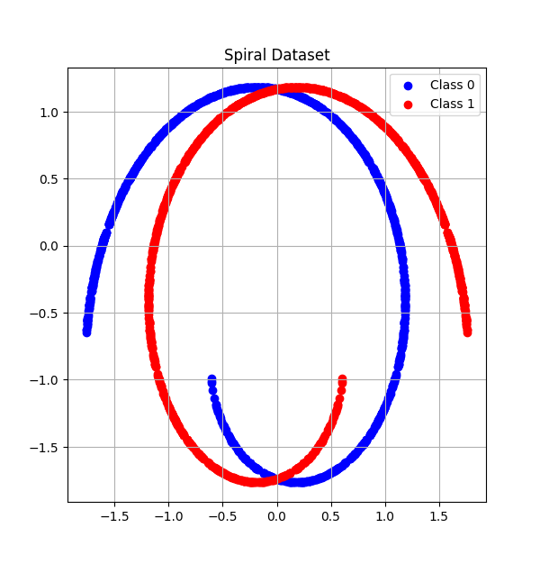

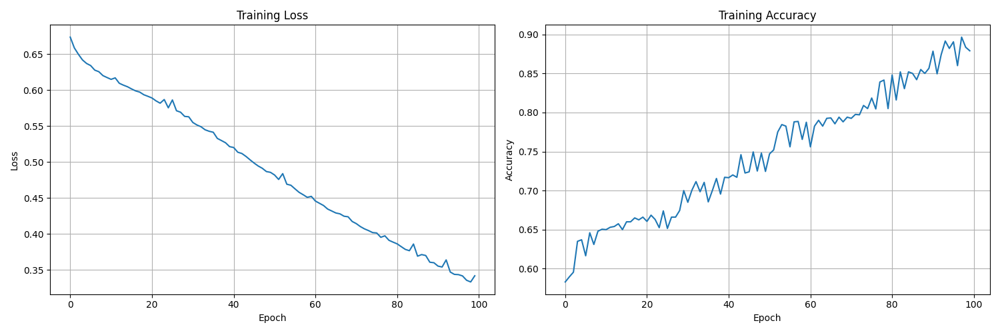

---

### The Problem of Machine Translation

Paper Link: 
- [Neural machine Translation By Jointly Learning to Align and Translate (Sep 2014)](https://arxiv.org/pdf/1409.0473)
- [Sequence to Sequence Learning with Neural Networks (Dec 2014)](https://arxiv.org/pdf/1409.3215)
- [Effective Approaches to Attention-based Neural Machine Translation (Sep 2015)](https://arxiv.org/pdf/1508.04025v5)

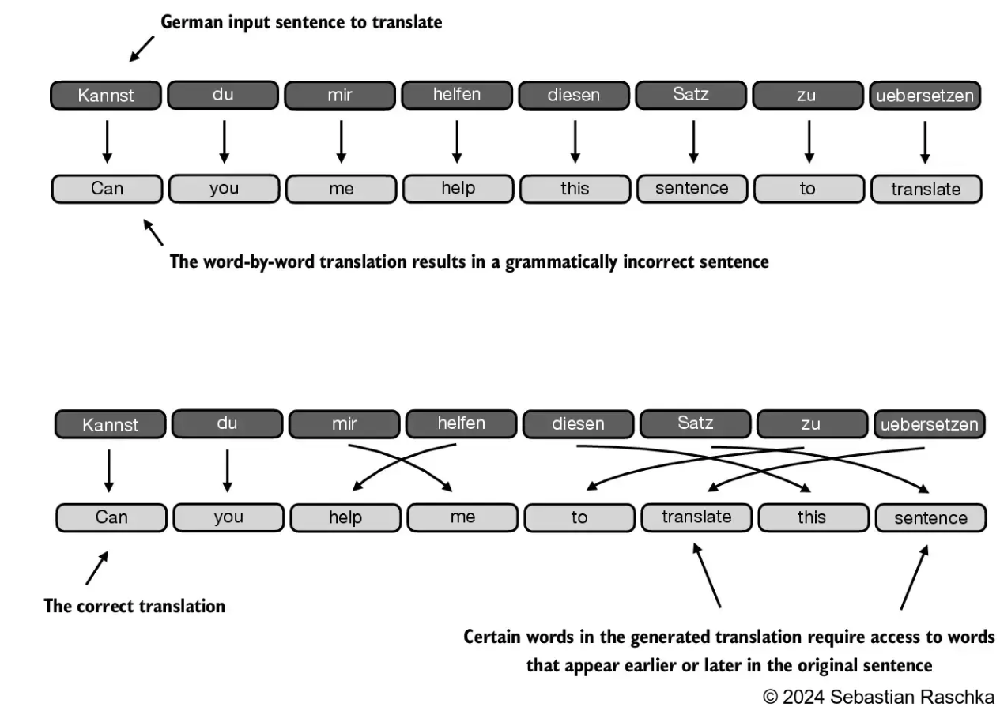

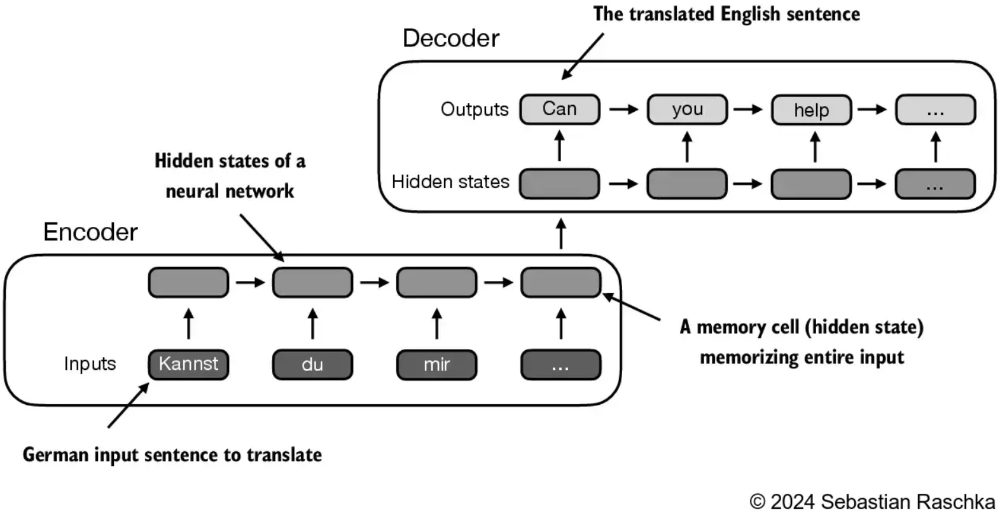

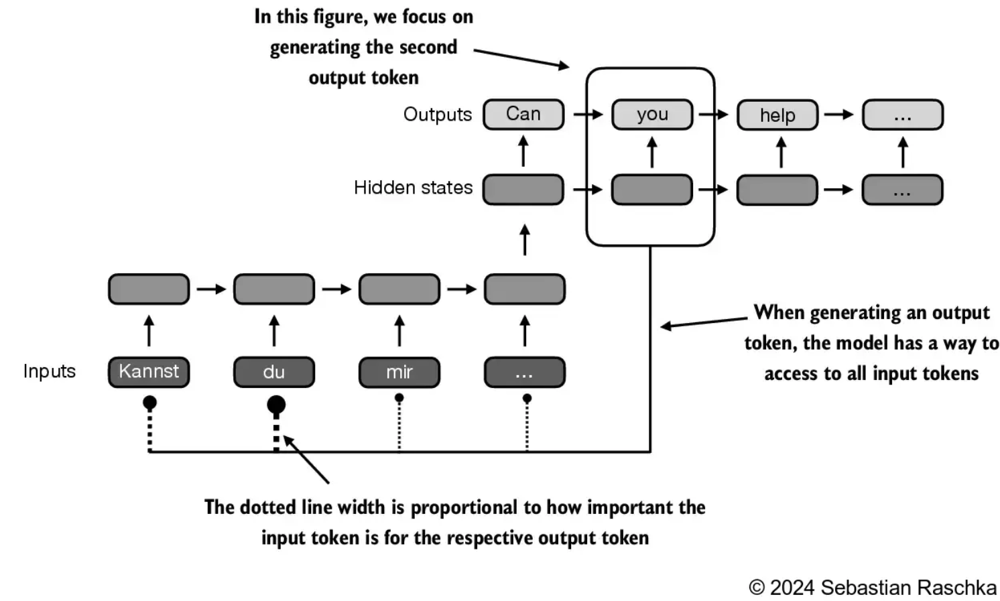
[Image taken from Build a Large Language Model from scratch by Sebastian Raschka. Link: https://github.com/rasbt/LLMs-from-scratch]

#### Story of Attention

[Image used from Andrej Karpathy Tweet. Link: https://x.com/karpathy/status/1864023344435380613?lang=en]

## Attention is All you Need (June, 2017)

- [**Paper Link**](https://arxiv.org/abs/1706.03762)
- What Transformers Solved:
  - **Sequential Processing and Parallelization**
    - The fundamental limitation of RNNs was their sequential nature - they had to process inputs one token at a time in order. This meant:
    - Training was slow since computations couldn't be parallelized. 
    - The model had to wait for earlier tokens to be processed before handling later ones
    - Transformers solved this by processing all input tokens simultaneously through self-attention, allowing massive parallelization.
  - **Long-Range Dependencies**
    - While attention helped RNNs with long-range dependencies, they still struggled because:
      - Information had to flow through many sequential steps
      - Even with attention, the model tended to focus more on recent tokens
      - Gradients could still vanish over very long sequences
    - Transformers' self-attention mechanism allows direct connections between any two tokens, regardless of their distance in the sequence.
  - **Fixed Context Window**
     - RNN-based models with attention still had limitations with:
      - Memory constraints for very long sequences
      - Difficulty maintaining context over long distances
      - Computational complexity growing quadratically with sequence length
    - Transformers introduced positional encodings and multi-head attention that better handled long-range patterns and relative positions.
  - **Information Bottleneck**
    - In Seq2Seq RNNs:
      - All information had to be compressed into a fixed-size context vector
      - Even with attention, information still flowed through this bottleneck
      - Complex relationships between distant elements were hard to capture
    - Transformers' self-attention allows rich, direct interactions between all elements of the sequence.
  - **Training Stability**
    - RNNs faced challenges with:
      - Vanishing/exploding gradients over long sequences
      - Difficulty in training deep architectures
      - Unstable optimization
    - Transformers' architecture, along with layer normalization and residual connections, made training deeper networks more stable.

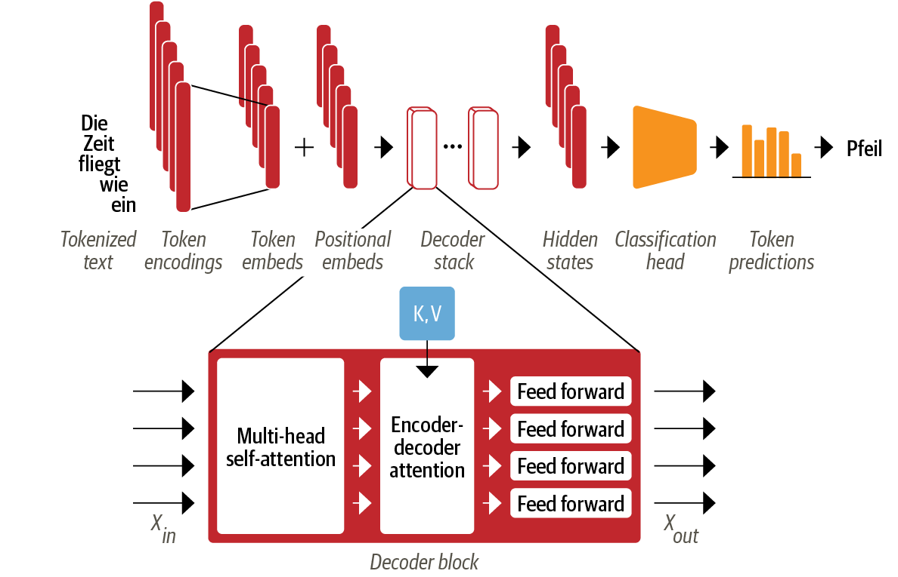
[Images used from NLP with Transformers book. Link: https://github.com/nlp-with-transformers]

## GPT-Like Large Language Model

- [**GPT-1 (2018)**](https://openai.com/index/language-unsupervised/)
- [**GPT-2 (2019)**](https://openai.com/index/better-language-models/)
- [**GPT-3 (2020)**](https://arxiv.org/abs/2005.14165)
- [**Instruction Fine-Tuning (2022)**](https://openai.com/index/instruction-following/)

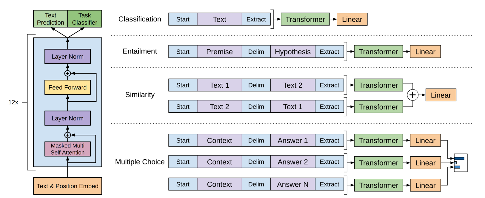

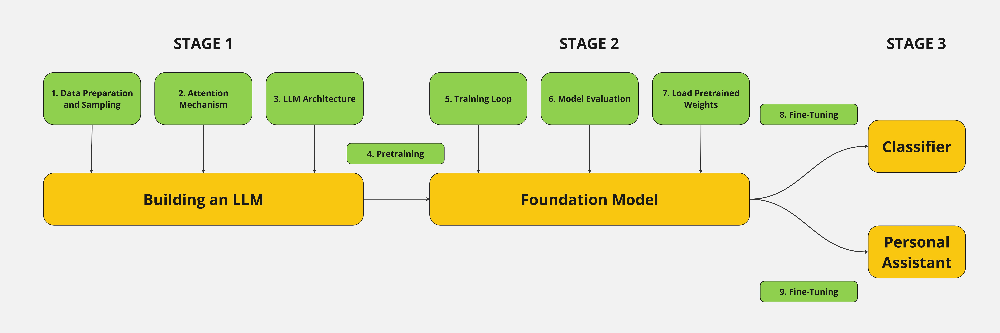

### Step-1: Data Preparation and Sampling

#### Tokenization and Input Embedding

- GPT-like models uses Byte Pair Encoding(BPE) Algorithm.
- The Algorithm was published in [**Paper**](http://www.pennelynn.com/Documents/CUJ/HTML/94HTML/19940045.HTM)
- Working of BPE Algorithm:
  - Identify frequent pairs:
    - In each Iteration, scan the text to find the most commonly occurring pair of bytes (or characters).
  - Replace and Record:
    - Replace the most commonly occurring pairs with a new Placeholder ID.
    - Record this mapping in a lookup table.
    - Size of the lookup table is a hyperparameter, called as vocabulary size. (For GPT-2, its 50,257))
  - Repeat until no gains
    - Keep repeating steps 1 and 2, continually merging the most frequent pairs.
    - Stop when no further compression is possible.
  - Decompression(decoding)
    - Reverse the process by substituting each ID with its corresponding pair, using the lookup table.

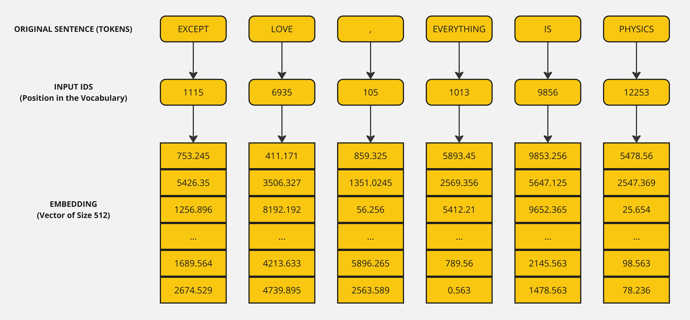

#### Positional Encoding

- Does order matter in attention? No!!!
- Attention is "permutation invariant". It doesn't matter how we order the words in our input sequence because the amount of attention any token pays to another is purely a function of their Embeddings and the Weight Matrices.
- Adds positional information to the existing embeddings.

**A Positional Encoding is a finite dimensional representation of the location or 'position' of items in a sequence. Given some sequence A = [a_0, a_1, ...., a_{n-1}], the positional encoding must be some type of tensor that we can feed to a model to tell it where some value a_i is in the sequence A.**

- **Thought 1: Just Count.**
    - Its an **absolute positional encoding**.
    - Scale is an issue here. Scale of these number is large.
    - Consider we have 500 tokens, we'll end up with a 500 in vector. Neural network work efficiently with their weights around zero and usually balanced positive and negative, Else, it will cause problems like exploding gradients and unstable training.

    

- **Thought 2: Normalize the count above**
    - Based on above method limitations, its an obvious approach -> Just divide by the largest integer so all of the values are in range [0,1].
    - The issue is *Normalizing doesn't work with variable sequence lengths.*
    - For e.g., if sequence length is 5, "0.8" would mean 4th element. But if sequence length is 20, "0.8" would mean 16the element.

    

- **Thought 3: Use Binary instead of Decimal.**
    - Instead of writing "35" for the 35th element, we could instead represent its binary form 100011.
    - This will involve *converting our integer to binary* and *converting our scalar to vector*. i.e. we are increasing the dimensionality but it helps in keeping arbitrary long sequences and that too in range [0, 1].

    
    - Issue:
        - Its still not fully normalized. We need things to be positive and negative roughly equally. However, it can be fixed by rescaling using `f(x) = 2x - 1`
        - However, the binary vectors above come from a discrete function and not a discretization of continuous function. Consider an example, Try to measure a distance from 0->3. A continuous encoding can be analogous to `y = x`. Continuous Encoding [x, 0]. However binary encoding can ony represent 4 positions: 0, 1, 2, 3. Binary Encoding: [0, 0], [0, 1], [1, 0], [1, 1]

***Basically, We need to find a way to make the binary vector a discretization of something continuous. Geometrically, We need to find an embedding manifold. Humanly, we are looking for a curve in the embedding dimensional space, such that as we walk along it slowly increases our 'position' in a continuous way***

- **Thought 4: Use a Continuous Binary Vector**
    - To make binary vector continuous, we need a function that interpolates a back and forth cycle 0->1->0->0...etc. Basically, we are looking for Cyclic functions. Trignometric functions(Sine, Cosine) are best suited as their range lies in [-1, 1]

$$ PE(pos, 2i) = sin\frac{pos}{10000^{\frac{2i}{d_{model}}}} $$

$$ PE(pos, 2i + 1) = cos\frac{pos}{10000^{\frac{2i}{d_{model}}}} $$

- Trigonometric functions like **cos** and **sin** naturally represent a pattern that the model can recognize as 
continuous, so relative positions are easier to see for the model.

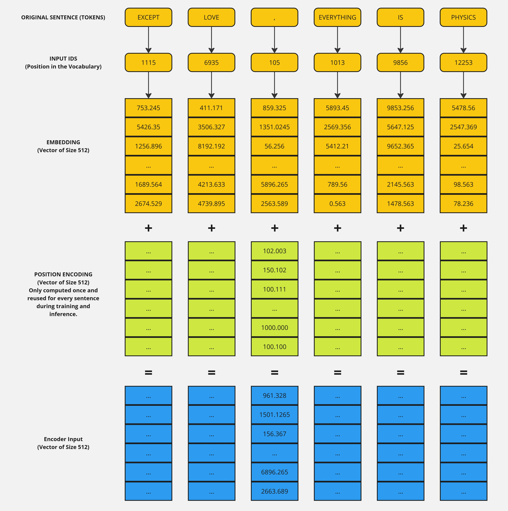

### Step-2: Attention

- In self-attention, the "self" refers to the mechanism's ability to compute attention weights by relating different positions within a single input sequence.
- It assesses and learns the relationships and dependencies between various parts of the input itself, such as words in a sentence or pixels in an image.

- **Goal of Self-Attention**

- **Intuition**

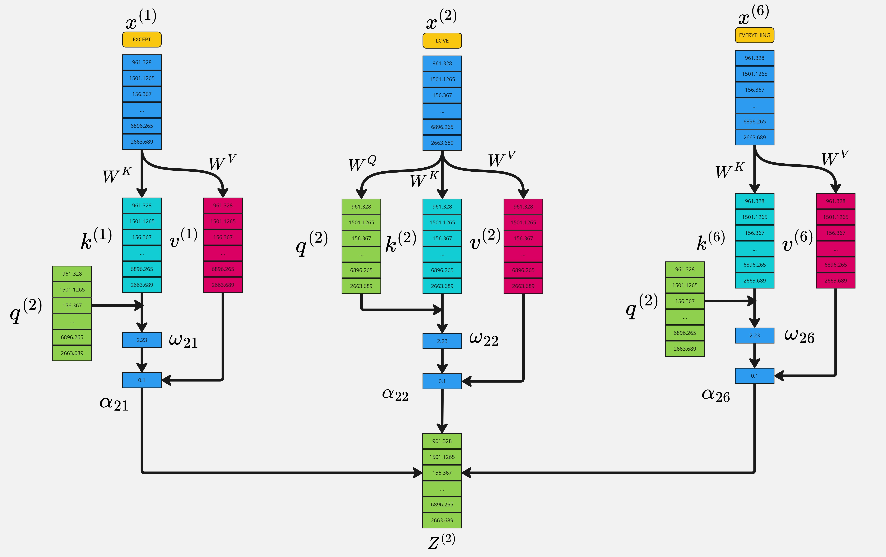

$$ Attention(Q, K, V) = Softmax(\frac{(QK^T)}{\sqrt(d_k)})V $$

- Reason for normalization by the embedding dimension size is to improve the training performance by avoiding small gradients.
- The terms "key", "query" and "value" in the context of attention mechanisms are borrowed from domain of information retrieval and databases, where similar concepts are used to store, search and retrieve information.

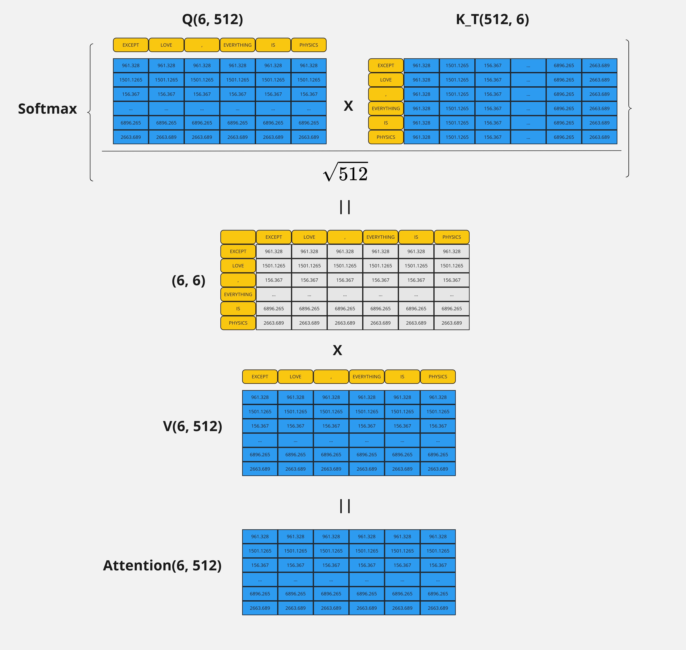

- Self-Attention allows the model to relate words to each other.
- Each row in the final Attention matrix not only captures meaning(provided by the embedding) or the position in the 
sentence (provided by the positional encodings) but also each word's interaction with other words.
- Self-Attention is permutation invariant.

#### Multi-Head Attention

$$ \text{MultiHead}(Q, K, V) = \text{Concat}(head_1,...,head_h)W^O $$
$$ \text{head}_i = \text{Attention}(QW_i^Q, KW_i^K, VW_i^V) $$

$\text{where, } W_i^Q \in \mathbb{R}^{d_{\text{model}} \times d_k}, W_i^K \in \mathbb{R}^{d_{\text{model}} \times d_k}, W_i^V \in \mathbb{R}^{d_{\text{model}} \times d_v}, W^O \in \mathbb{R}^{hd_v \times d_{\text{model}}}$

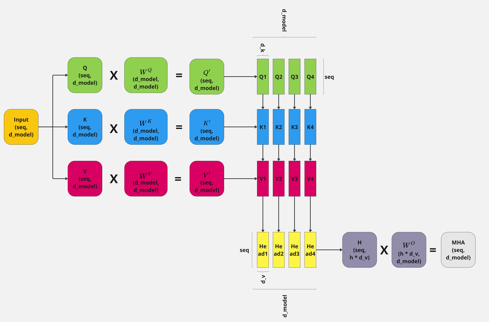

### Step 3-LLM Architecture

![gpt-2-arch.jpg]

#### Layer Normalization

- [Paper Link](https://arxiv.org/abs/1607.06450)
- ![layer-normalization.png]
#### Activation Function
- [GeLU Paper](https://arxiv.org/abs/1606.08415)
- [SwiGLU Paper](https://arxiv.org/pdf/2002.05202)

$$GELU(x) \approx 0.5 \times x \times (1 + tanh[\sqrt{\frac{2}{\pi}} \times (x + 0.044715 \times x^{3})]) $$
![activation-function.png]
### Feed Forward Network
![model_architecture_with_params.png]